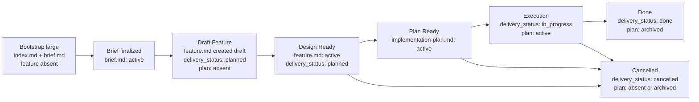

# Feature Flow

This document defines the order in which feature artifacts appear. The agent must advance a feature package by stage and must not create downstream artifacts before their upstream owner is ready.

## Package rules

1. All documents for one feature live under `memory-bank/features/FT-XXX/`.
2. **Feature = vertical slice.** One feature is one unit of user value across all touched layers (UI, API, storage, infra). Horizontal cuts ("all endpoints", "all UI") are only allowed for purely infra or refactoring work and must be explicitly justified via `NS-*`.
3. `feature.md` is the canonical owner for intent, delivery-scoped target outcome/KPI, design, and verify for the delivery unit.
4. `brief.md` is an optional problem-formalization artifact: **required** when the package uses [`large.md`](templates/feature/large.md), **absent** when the package uses [`short.md`](templates/feature/short.md). It captures context, problem, success sketch, constraints, sketch non-goals, and open questions in prose and bullets only—it does not own stable identifiers (`REQ-*`, `SC-*`, …), traceability, or implementation sequence.
5. `index.md` is the routing layer for the full lifecycle. **Short path:** create `index.md` and `feature.md` together at bootstrap. **Large path (greenfield):** create `index.md` and `brief.md` at bootstrap; **do not add `feature.md`** until `brief.md` is reviewed, finalized, and `status: active`, then create `feature.md` and link it from `index.md`. **Large path (upgrade from `short.md`):** add and finalize `brief.md` to `status: active` before evolving the existing `feature.md` toward the `large.md` contract—treat the pre-brief file as provisional until the active brief is reflected.
6. `implementation-plan.md` is a derived execution document. It must not exist until sibling `feature.md` is design-ready.
7. For canonical `feature.md`, feature-level `index.md`, `brief.md` (large path), and `implementation-plan.md`, use wrapper templates from `memory-bank/flows/templates/feature/`: the template file has `doc_function: template`, while frontmatter/body of the instantiated document live inside the embedded template contract.
8. The meaning of stable identifiers (`REQ-*`, `NS-*`, `CHK-*`, `STEP-*`, etc.) is defined in the "Stable identifiers" section below.
9. Acceptance scenarios (`SC-*`) cover the vertical slice end-to-end: from input event to observable outcome across all touched layers. Testing a single layer in isolation is allowed as an implementation detail of the plan but does not replace end-to-end acceptance.
10. If the feature is part of a larger initiative, `feature.md` may depend on a PRD in `memory-bank/prd/`, but the PRD does not replace the feature package itself. Upstream context may be summarized in `brief.md` before it is reflected as deltas in `feature.md`.
11. If the feature creates a new durable project scenario or materially changes an existing one, the corresponding `UC-*` in `memory-bank/use-cases/` must be created or updated before closure.

## Choosing the `feature.md` template

`short.md` is only allowed when all of the following hold:

1. the feature can be described with `REQ-*`, `NS-*`, at most one `CON-*`, one `EC-*`, one `CHK-*`, and one `EVID-*`;
2. `feature.md` does not need `ASM-*`, `DEC-*`, `CTR-*`, `FM-*`, rollout/backout rules, or ADR-dependent design rules;
3. the change does not introduce or alter an API, event, schema, file format, CLI, or env contract;
4. verify fits in one primary check without quality slices and without multiple acceptance scenarios.

If any condition fails, the agent must choose or upgrade to `large.md` before continuing. Upgrade is also mandatory if the feature started as `short.md` but later required `ASM-*`, `DEC-*`, `CTR-*`, `FM-*`, more than one acceptance scenario, or more than one `CHK-*` / `EVID-*`.

When `large.md` is chosen (including after an upgrade from `short.md`), if `brief.md` is missing the agent must create it from [`brief.md`](templates/feature/brief.md) before any canonical `feature.md` work. Complete review and finalization until `brief.md` → `status: active`, **then** create or upgrade `feature.md` from [`large.md`](templates/feature/large.md) and align it with the active brief before promoting `feature.md` to design-ready.

## Problem brief (`brief.md`)

For the **large** path only, `brief.md` is the first place to nail intent: context, a single sharp problem statement, a success sketch, constraints, sketch non-goals, and open questions. **Greenfield:** `feature.md` is not created until `brief.md` is `status: active`. **Upgrade from short:** any pre-existing `feature.md` is not authoritative for large-slice design until `brief.md` is `status: active` and the file is aligned with it. Authority order for scope and acceptance remains **`feature.md` > `brief.md`**: if they diverge after design-ready, update or archive `brief.md` and keep `feature.md` canonical.

Stable IDs begin in `feature.md`, not in `brief.md`.

## Lifecycle

On the **short** path, omit the `BI` and `BF` nodes: bootstrap creates `index.md` and `feature.md` together, with no `brief.md` file. The **short** path joins at `DF`.

## Transition gates

Each gate is a set of checkable predicates. A transition is allowed if and only if all predicates are true.

**Short → large upgrade:** If the directory already has `feature.md` from the short path, skip **Bootstrap feature package — large path**; add and finalize `brief.md`, then satisfy **Brief finalized → draft feature allowed** (treating the existing file as provisional until aligned with the active brief and `large.md`).

### Bootstrap feature package — short path

- [ ] `index.md` created from `templates/feature/index.md`
- [ ] `feature.md` created from `short.md`
- [ ] `implementation-plan.md` absent
- [ ] `brief.md` must not exist

### Bootstrap feature package — large path (brief-first, greenfield)

- [ ] `index.md` created from `templates/feature/index.md`
- [ ] `brief.md` created from `templates/feature/brief.md` and linked from `index.md` (see template body)
- [ ] `implementation-plan.md` absent
- [ ] `feature.md` must not exist

### Brief finalized → draft feature allowed (large path only)

- [ ] `brief.md` reviewed and finalized (stakeholder alignment as required by the initiative)
- [ ] `brief.md` → `status: active`
- [ ] `feature.md` instantiated **or** updated from `large.md`, aligned with the active brief, and linked from `index.md`
- [ ] `feature.md` → `status: draft`, `delivery_status: planned`
- [ ] `implementation-plan.md` absent

### Draft → Design ready

- [ ] `feature.md` → `status: active`
- [ ] `What` section contains ≥ 1 `REQ-*` and ≥ 1 `NS-*`
- [ ] `Verify` section contains ≥ 1 `SC-*`
- [ ] each `REQ-*` traces to ≥ 1 `SC-*` via the traceability matrix
- [ ] `Verify` contains ≥ 1 `CHK-*` and ≥ 1 `EVID-*`
- [ ] if the deliverable cannot be accepted without negative/edge coverage → ≥ 1 `NEG-*`
- [ ] if `brief.md` exists: `brief.md` is already `status: active` from the upstream gate **or** `archived` with a one-line note that intent was folded into `feature.md`; prose there must not contradict `feature.md` `What` / `Verify`

### Design ready → Plan ready

- [ ] agent completed grounding: walked current system state (relevant paths, existing patterns, dependencies) and recorded results in the discovery context section of `implementation-plan.md`
- [ ] `implementation-plan.md` created from `templates/feature/implementation-plan.md`
- [ ] `implementation-plan.md` → `status: active`
- [ ] `implementation-plan.md` contains ≥ 1 `PRE-*`, ≥ 1 `STEP-*`, ≥ 1 `CHK-*`, ≥ 1 `EVID-*`
- [ ] discovery context in `implementation-plan.md` includes: relevant paths, local reference patterns, unresolved questions (`OQ-*`), test surfaces, and execution environment

### Plan ready → Execution

- [ ] `feature.md` → `delivery_status: in_progress`
- [ ] `implementation-plan.md` → `status: active`
- [ ] `implementation-plan.md` records test strategy: automated coverage surfaces, required local/CI suites
- [ ] each manual-only gap has a reason, manual procedure, and `AG-*` with approval ref

### Execution → Done

- [ ] every `CHK-*` from `feature.md` has pass/fail result in evidence
- [ ] every `EVID-*` from `feature.md` is filled with concrete carriers (file path, CI run, screenshot)
- [ ] automated tests for the change surface added or updated
- [ ] required test suites green locally and in CI
- [ ] each manual-only gap explicitly approved by a human (approval ref in `AG-*`)
- [ ] simplify review completed: code minimally complex or complexity justified via `CON-*`, `FM-*`, or `DEC-*`
- [ ] if the feature adds a new stable flow or materially changes an existing project-level scenario, the corresponding `UC-*` is created or updated and registered in `memory-bank/use-cases/index.md`
- [ ] `feature.md` → `delivery_status: done`
- [ ] `implementation-plan.md` → `status: archived`

### → Cancelled (large path, before `feature.md` exists)

- [ ] `brief.md` → `status: archived` with a one-line note that the slice will not proceed to canonical `feature.md` (or equivalent abandonment signal per template)
- [ ] `feature.md` remains absent
- [ ] `implementation-plan.md` absent

### → Cancelled (from any stage after feature draft)

- [ ] `feature.md` → `delivery_status: cancelled`
- [ ] `implementation-plan.md` absent ∨ `status: archived`

## Boundary rules

1. `feature.md` must contain `What`, `How`, and `Verify` sections.
2. `brief.md` must not define `REQ-*` / `SC-*` / `CHK-*` / `EVID-*` inventories, traceability matrices, or `STEP-*` / workstream sequencing. It may reference upstream PRDs or ADRs by link; it does not supersede them or `feature.md`.
3. `Verify` in `feature.md` defines the canonical test case inventory for the delivery unit: positive cases via `SC-*`, feature-specific negative coverage via `NEG-*` when needed, executable checks via `CHK-*`, and evidence via `EVID-*`.
4. If the feature depends on an ADR, `feature.md` links to the file in `memory-bank/adr/` and respects its `decision_status`; `proposed` is not considered finalized design.
5. If the feature depends on a canonical use case, `feature.md` links to the file in `memory-bank/use-cases/`. The use case remains owner of trigger/preconditions/main flow/postconditions at project level; `feature.md` only records slice-specific implementation.
6. `implementation-plan.md` remains a derived execution document: it references canonical IDs from `feature.md` or ADRs, records test strategy for execution, required local/CI suites and approval refs for manual-only gaps, and does not redefine scope, architecture, blockers, acceptance criteria, or the evidence contract.
7. If scope, architecture, acceptance criteria, or the evidence contract change, update `feature.md` or the ADR first, then the downstream plan. If `brief.md` exists and intent changed materially, update or archive `brief.md` so it does not mislead readers.
8. If a numeric target threshold applies only to one delivery unit, the canonical owner is the corresponding `feature.md`. Promote such a KPI to a project-level document only after it becomes a shared upstream fact for several features.
9. A good `implementation-plan.md` starts with discovery context: relevant paths, local reference patterns, unresolved questions, test surfaces, and execution environment must be recorded before sequencing changes.
10. For risky, irreversible, or externally visible actions, `implementation-plan.md` must explicitly describe human approval gates and must not hide them inside prose steps.

## Test ownership summary

Canonical testing policy lives in [../engineering/testing-policy.md](../engineering/testing-policy.md). Below is enough to create a feature package without opening the policy document.

1. **Canonical test cases** for the delivery unit are defined in `feature.md` via `SC-*`, feature-specific `NEG-*`, `CHK-*`, and `EVID-*`. `implementation-plan.md` only owns execution strategy: which suites to add, which gaps are temporarily manual-only and why.
2. **Sufficient coverage** = main changed behavior, new or changed contracts, critical failure modes from `FM-*`, and feature-specific negative/edge scenarios if they change the verdict. Line coverage percentage alone is insufficient.
3. **Manual-only** is only allowed as an explicit exception (live infra, hardware, non-deterministic environment). For each gap: reason, manual procedure or `EVID-*`, follow-up owner, and approval ref via `AG-*`.
4. **By design ready** `feature.md` already records the test case inventory: at least one `SC-*`, traceability to `REQ-*`. **By done** — automated tests added, required suites green locally and in CI.
5. **Simplify review** is a separate pass after functional tests, before closure. Goal: confirm code is minimally complex. Three similar lines beat premature abstraction. Complexity is only justified with a reference to `CON-*`, `FM-*`, or `DEC-*`.
6. **Verification context separation** — functional verification, simplify review, and acceptance test are three logically separate passes. Between passes the agent states conclusions before starting the next. For short features one session is allowed, but simplify review is not skipped.

## Stable identifiers

### Feature IDs

| Prefix | Meaning | Used in |
| --- | --- | --- |
| `MET-*` | outcome metrics | `feature.md` |
| `REQ-*` | scope and required capability | `feature.md` |
| `NS-*` | non-scope | `feature.md` |
| `ASM-*` | assumptions and working premises | `feature.md` |
| `CON-*` | constraints | `feature.md` |
| `DEC-*` | blocking decisions | `feature.md` |
| `NT-*` | do-not-touch / explicit change boundaries | `feature.md` |
| `INV-*` | invariants | `feature.md` |
| `CTR-*` | contracts | `feature.md` |
| `FM-*` | failure modes | `feature.md` |
| `RB-*` | rollout / backout stages | `feature.md` |
| `EC-*` | exit criteria | `feature.md` |
| `SC-*` | acceptance scenarios | `feature.md` |
| `NEG-*` | negative / edge test cases | `feature.md` |
| `CHK-*` | checks | `feature.md`, `implementation-plan.md` |
| `EVID-*` | evidence artifacts | `feature.md`, `implementation-plan.md` |
| `RJ-*` | rejection rules | `feature.md`, `implementation-plan.md` |

### Plan IDs

| Prefix | Meaning | Used in |
| --- | --- | --- |
| `PRE-*` | preconditions | `implementation-plan.md` |
| `OQ-*` | unresolved questions / ambiguities | `implementation-plan.md` |
| `WS-*` | workstreams | `implementation-plan.md` |
| `AG-*` | approval gates for risky actions | `implementation-plan.md` |
| `STEP-*` | atomic steps | `implementation-plan.md` |
| `PAR-*` | parallelizable blocks | `implementation-plan.md` |
| `CP-*` | checkpoints | `implementation-plan.md` |
| `ER-*` | execution risks | `implementation-plan.md` |
| `STOP-*` | stop conditions / fallback | `implementation-plan.md` |

### Required minimum

1. Any canonical `feature.md` uses at least `REQ-*`, `NS-*`, `SC-*`, `CHK-*`, `EVID-*`.
2. Any `feature.md` with `status: active` defines at least one explicit test case via `SC-*`.
3. A short feature may only use the minimal set described in `memory-bank/flows/templates/feature/short.md`.
4. A large feature may use the extended feature ID set as needed.
5. Any `implementation-plan.md` uses at least `PRE-*`, `STEP-*`, `CHK-*`, `EVID-*`; when there is ambiguity or human approval gates, use `OQ-*` and `AG-*`.

### Traceability contract

1. Scope in `feature.md` is fixed via `REQ-*`, non-scope via `NS-*`.
2. Verify in `feature.md` links `REQ-*` to test cases via `Acceptance scenarios`, feature-specific `NEG-*`, `Traceability matrix`, `Test matrix`, and `Evidence contract`.
3. `implementation-plan.md` references canonical IDs from `feature.md` in `Implements`, `Verifies`, and `Evidence IDs` columns.
4. If sequencing is blocked by unknowns, the plan records them as `OQ-*`, not hidden in prose.
5. If execution requires human confirmation for risky actions, the plan records it via `AG-*`.
6. If an ID is used as a stable entity, its meaning must stay compatible with this document.
